# EOV COPILOT DEMO
## Tài Liệu Mô Tả Hệ Thống

## Mục Lục

1. [Tổng Quan Hệ Thống](#1-tổng-quan-hệ-thống)
2. [Kiến Trúc Microservice](#2-kiến-trúc-microservice)
3. [Thiết Kế Chi Tiết Từng Service](#3-thiết-kế-chi-tiết-từng-service)
4. [Công Nghệ Sử Dụng](#4-công-nghệ-sử-dụng)
5. [Kế Hoạch Xây Dựng](#5-kế-hoạch-xây-dựng)
6. [Yêu Cầu Đạt Được](#6-yêu-cầu-đạt-được)
7. [Tiêu Chí Đánh Giá](#7-tiêu-chí-đánh-giá)
8. [Phương Pháp Đánh Giá](#8-phương-pháp-đánh-giá)
9. [Dữ Liệu Demo & Test](#9-dữ-liệu-demo--test)

---

## 1. Tổng Quan Hệ Thống

### 1.1 Mục Tiêu

EOV COPILOT DEMO là nền tảng AI thông minh cho bảo trì công nghiệp, bao gồm:

- **EOV CoPilot**: RAG-based chatbot agent hỗ trợ tra cứu tài liệu kỹ thuật
- **EOV Predict™**: Module AI dự báo hư hỏng 

### 1.2 High-Level Architecture

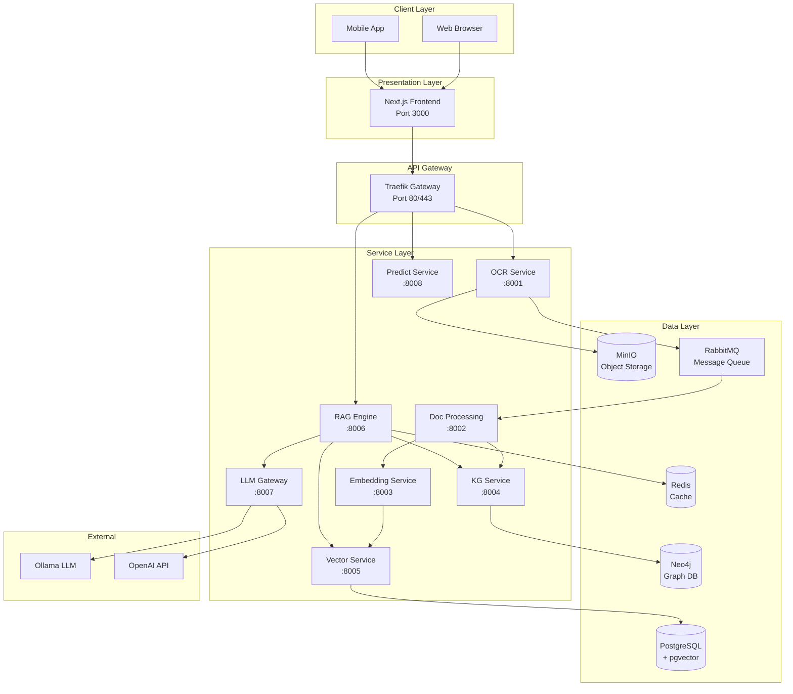

---

## 2. Kiến Trúc Microservice

### 2.1 Service Communication Diagram

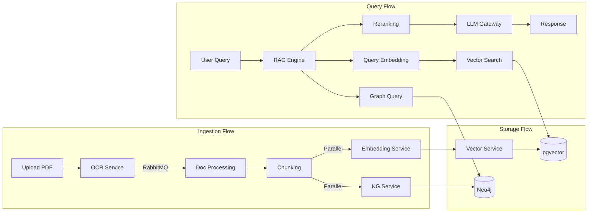

### 2.2 Event-Driven Architecture

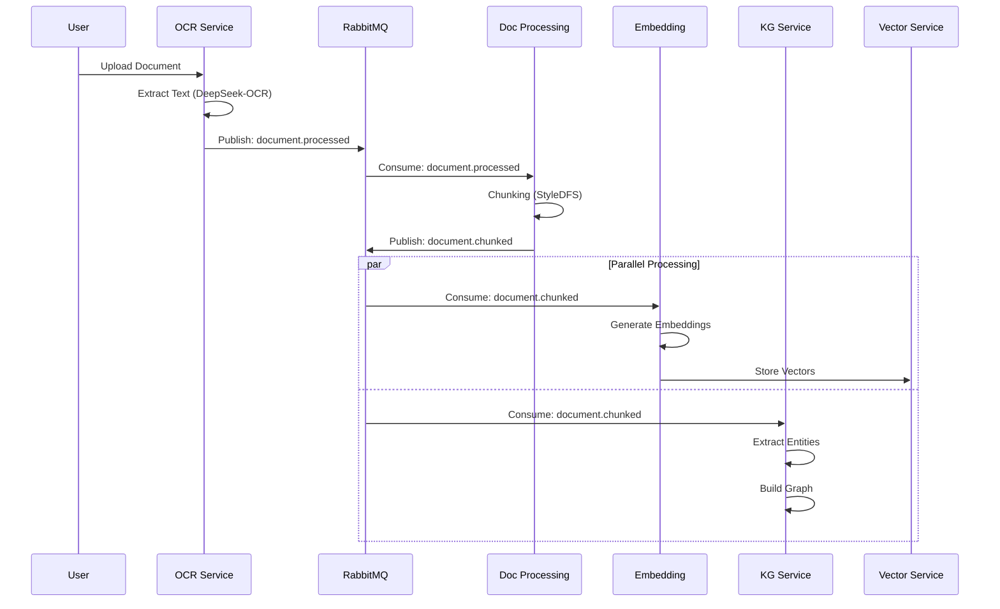

### 2.3 Data Flow Diagram

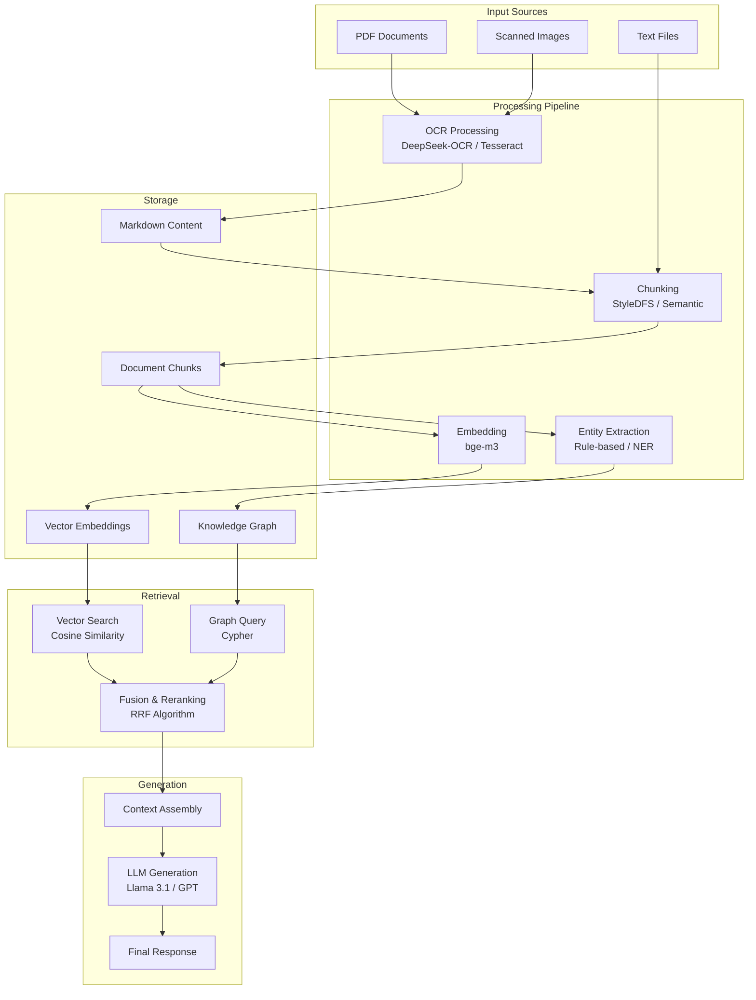

---

## 3. Thiết Kế Chi Tiết Từng Service

### 3.1 OCR Service

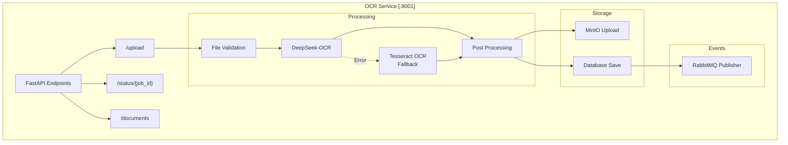

**Endpoints:**
| Method | Path | Description |
|--------|------|-------------|
| POST | `/api/v1/ocr/upload` | Upload document |
| GET | `/api/v1/ocr/status/{job_id}` | Check job status |
| GET | `/api/v1/ocr/documents` | List documents |
| GET | `/api/v1/ocr/documents/{id}` | Get document |
| DELETE | `/api/v1/ocr/documents/{id}` | Delete document |

---

### 3.2 Document Processing Service

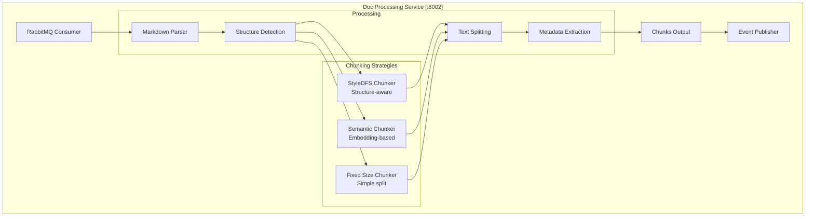

**Chunking Strategies:**
| Strategy | Use Case | Chunk Size |
|----------|----------|------------|
| StyleDFS | Structured docs (headers, tables) | Variable |
| Semantic | Long paragraphs | 500-1000 tokens |
| Fixed | Simple text | 1000 chars |

---

### 3.3 Embedding Service

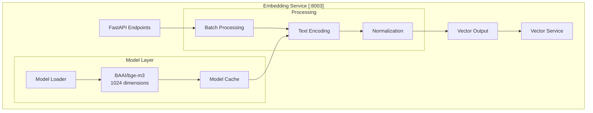

**Model Specifications:**
| Parameter | Value |
|-----------|-------|
| Model | BAAI/bge-m3 |
| Dimensions | 1024 |
| Max Sequence | 8192 tokens |
| GPU Required | Recommended |

---

### 3.4 Knowledge Graph Service

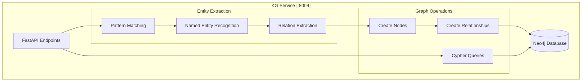

**Entity Types:**
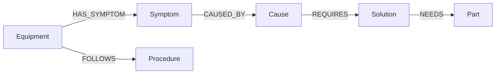

---

### 3.5 Vector Service

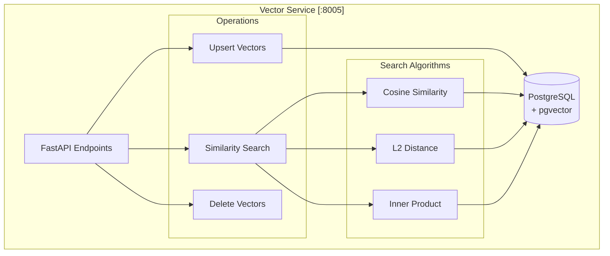

**Index Configuration:**
| Parameter | Value |
|-----------|-------|
| Index Type | HNSW |
| Dimension | 1024 |
| Distance | Cosine |
| ef_construction | 128 |
| m | 16 |

---

### 3.6 RAG Engine Service

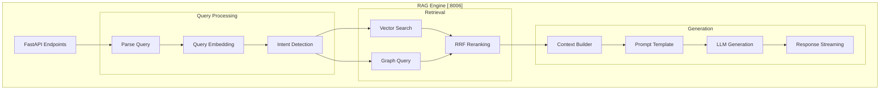

**RAG Fusion Algorithm:**
```
RRF Score = Σ (1 / (k + rank_i))

where:
- k = 60 (constant)
- rank_i = position in each result list
```

---

### 3.7 LLM Gateway Service

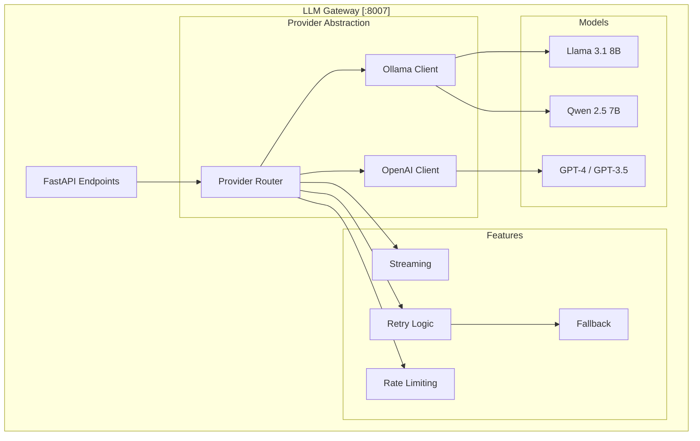

---

### 3.8 Predict Service

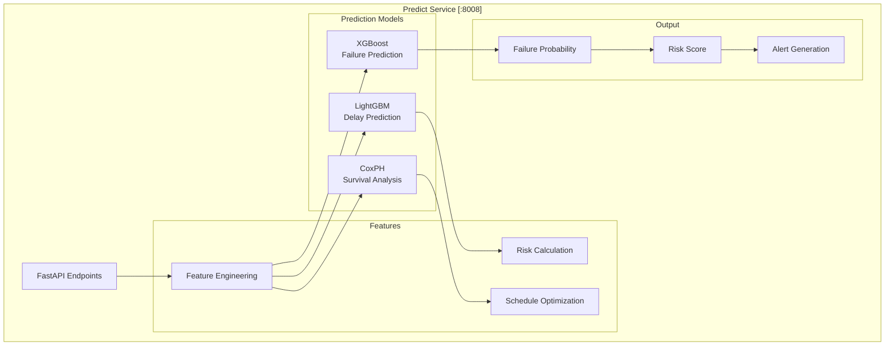

**Risk Level Classification:**
| Score Range | Level | Action |
|-------------|-------|--------|
| 70-100 | HIGH | Immediate action required |
| 40-69 | MEDIUM | Plan maintenance |
| 0-39 | LOW | Monitor |

---

## 4. Công Nghệ Sử Dụng

### 4.1 Backend Technologies

| Layer | Technology | Version | Purpose |
|-------|------------|---------|---------|
| **Runtime** | Python | 3.11 | Main programming language |
| **Framework** | FastAPI | 0.104+ | REST API framework |
| **ASGI** | Uvicorn | 0.24+ | ASGI server |
| **Validation** | Pydantic | 2.0+ | Data validation |
| **ORM** | SQLAlchemy | 2.0+ | Database ORM |
| **Async HTTP** | httpx | 0.25+ | HTTP client |

### 4.2 AI/ML Technologies

| Component | Technology | Purpose |
|-----------|------------|---------|
| **OCR** | DeepSeek-OCR | Document digitization |
| **OCR Fallback** | Tesseract | Backup OCR |
| **Embedding** | BAAI/bge-m3 | Text to vector |
| **LLM (Local)** | Ollama + Llama 3.1 | Text generation |
| **LLM (Cloud)** | OpenAI GPT | Alternative LLM |
| **ML** | XGBoost, LightGBM | Predictions |

### 4.3 Data Storage

| Type | Technology | Version | Purpose |
|------|------------|---------|---------|
| **Relational DB** | PostgreSQL | 16 | Primary database |
| **Vector DB** | pgvector | 0.7+ | Vector search |
| **Graph DB** | Neo4j | 5.15 | Knowledge graph |
| **Cache** | Redis | 7 | Session & cache |
| **Object Storage** | MinIO | Latest | File storage |
| **Message Queue** | RabbitMQ | 3 | Event messaging |

### 4.4 Frontend Technologies

| Technology | Version | Purpose |
|------------|---------|---------|
| Next.js | 14+ | React framework |
| TypeScript | 5+ | Type safety |
| TailwindCSS | 3+ | Styling |
| React | 18+ | UI library |


---

## 5. Kế Hoạch Xây Dựng

### 5.1 Timeline 


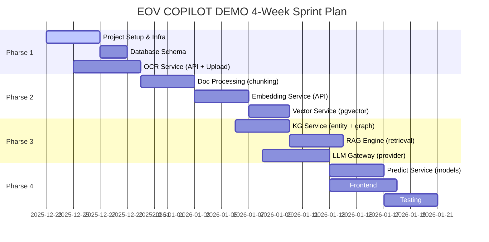

### 5.2 Milestones

| Week | Milestone | Status |
|------|-----------|--------|
| 1 | Foundation up + OCR basic | In progress |
| 2 | Doc pipeline + Embedding + Vector store | Planned |
| 3 | KG + RAG + LLM integration | Planned |
| 4 | Predict models + Frontend + Testing/Deploy | Planned |


### 5.3 Sprint Planning (4-week breakdown & task ownership)
Tuần 1
- [ ] Thiết lập dự án, repository
- [ ] Môi trường (tệp .env)
- [ ] OCR Service: endpoint upload, pipeline xử lý cơ bản

Tuần 2
- [ ] Xử lý tài liệu: chiến lược chia đoạn, hooks sự kiện
- [ ] Embedding Service: loader mô hình, API mã hóa
- [ ] Vector Service: schema pgvector, API upsert/search

Tuần 3
- [ ] KG Service: trích xuất thực thể và kết nối Neo4j
- [ ] RAG Engine: luồng truy vấn, hợp nhất vector + đồ thị
- [ ] LLM Gateway: trừu tượng hóa provider & streaming

Tuần 4
- [ ] Predict Service: pipeline đặc trưng và endpoint mô hình cơ bản
- [ ] Frontend: UI Chat + tích hợp tối thiểu Dashboard Predict
- [ ] Kiểm thử


---

## 6. Yêu Cầu Đạt Được

### 6.1 Functional Requirements

| ID | Requirement | Priority | Status |
|----|-------------|----------|--------|
| FR-01 | Upload và OCR tài liệu PDF/Image | High |  |
| FR-02 | Chunking thông minh giữ nguyên cấu trúc | High |  |
| FR-03 | Vector search với pgvector | High |  |
| FR-04 | Knowledge Graph với Neo4j | Medium |  |
| FR-05 | RAG query với streaming response | High |  |
| FR-06 | Multi-provider LLM support | Medium |  |
| FR-07 | Schedule optimization | Medium |  |
| FR-08 | Chat history | High |  |
---

## 7. Tiêu Chí Đánh Giá

### 7.1 AI Quality Metrics

| Metric | Evaluation Method |
|--------|-------------------|
| **OCR Accuracy** | Character Error Rate (CER) |
| **Retrieval Precision** | Manual annotation |
| **Retrieval Recall** | Manual annotation |
| **Answer Relevance** | Human evaluation |
| **Prediction Accuracy** | Cross-validation |
| **F1 Score (Failure)** | Test dataset |

---